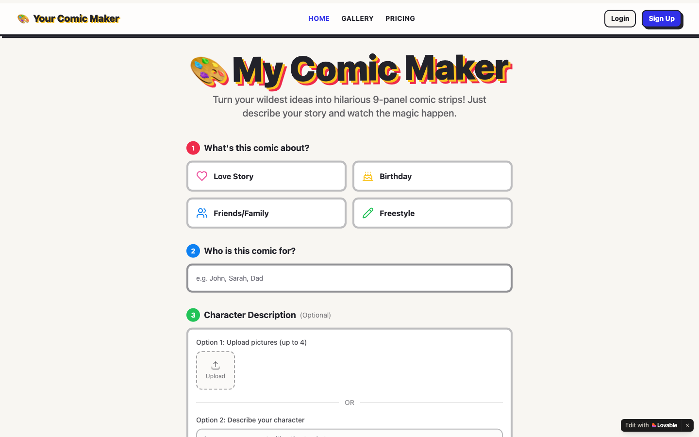

# My Comic Maker

**Turn a story and a few photos into a personalised 9-panel comic strip, with the same characters looking the same in every panel.**

[Try it →](https://mycomicmaker.lovable.app)

## The problem

A personalised comic, starring your kids, your friends or yourself, makes a great story or gift, but drawing one takes skill and hours. AI image tools can produce a single picture, but they struggle to keep a character looking like the same person from one panel to the next, which is what makes a comic read as a story.

## What it does

- **Pick an occasion:** a love story, a birthday, friends and family, or freestyle.
- **Say who it's for and describe the story** in a sentence or two.
- **Upload up to 4 photos to create characters,** or describe them in words. They keep a consistent look across all nine panels.
- **Generate the strip,** then download or share it. A public gallery shows examples.
- **Paid plans** through Stripe checkout and subscriptions.

<strong>Tech stack</strong>

React, TypeScript, Vite, Tailwind CSS, Supabase (Postgres, email sign-in, Edge Functions), Google Gemini text and image models, Stripe.

